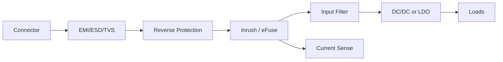

# 28 V Aviyonik Güç Hattı — Çalışma Notu

Bu dosya genel güç elektroniği bilgisini aviyonik 28 V güç mimarisi düşüncesine bağlamak için hazırlanmıştır.

## 1. 28 V hattı neden özel düşünülür?

28 V nominal bir sayı değildir; gerçek sistemde minimum, maksimum, transient, ripple, source impedance ve connector/harness etkileri vardır. Güç giriş devresi yalnız nominal akımı taşımakla değil, anormal durumları kontrollü karşılamakla da sorumludur.

## 2. Tipik bloklar



## 3. Kontrol soruları

- Giriş transient enerjisi nereye gidecek?
- TVS seçimi sadece breakdown voltajıyla mı yapıldı, enerji/pulse gücü kontrol edildi mi?
- Inrush sırasında kaynak veya eFuse trip olur mu?
- DC/DC giriş kapasitörü hot-plug anında ne kadar akım çeker?
- Return hattı ve şase bağlantısı nerede birleşiyor?
- EMI filtresinde common-mode ve differential-mode yollar ayrıldı mı?

## 4. Hesap çekirdeği

```text
Pload = Vout · Iout
Pin ≈ Pout / η
Iin ≈ Pin / Vin
Ecap = 1/2 C Vin²
Tj = Ta + P_loss θJA
```

## 5. Tasarım dersi

Güç hattı tasarımı sadece “regülatör seçimi” değildir. Koruma, sequencing, EMI, grounding, ısıl tasarım, test noktaları ve arıza modu birlikte ele alınır.
